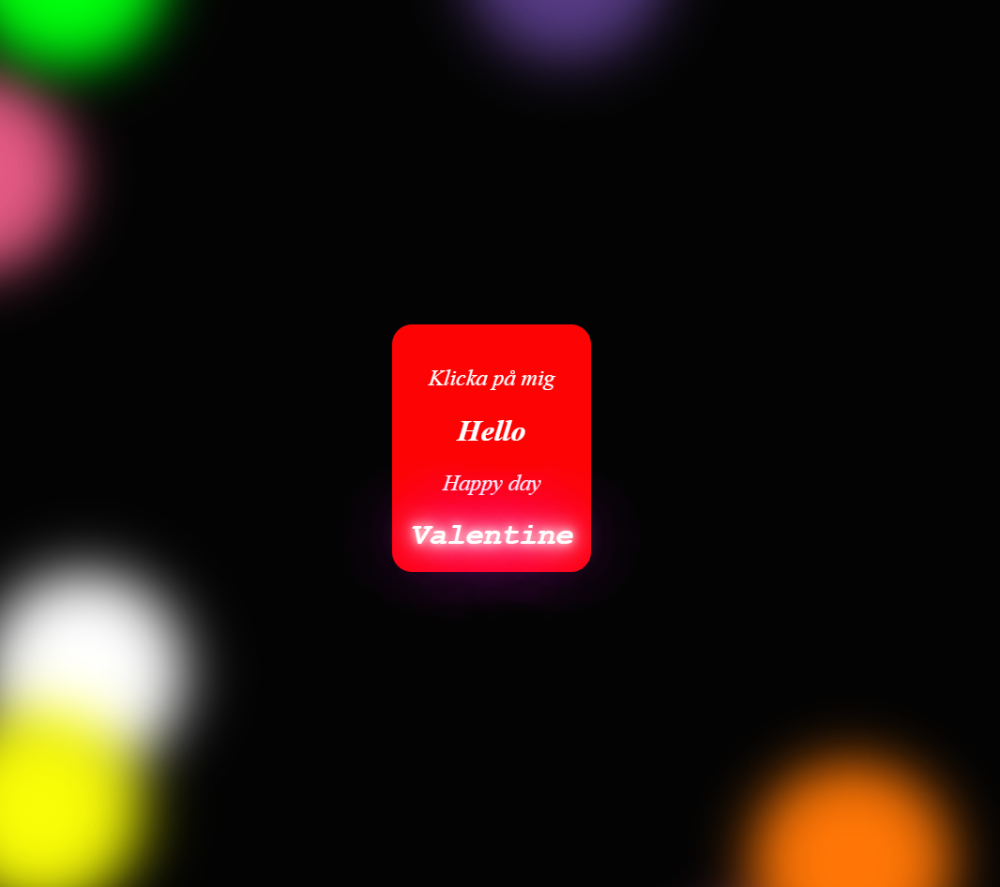

<h1 align='center'>Valentine Bounce 💖</h1>

<p align="center">A simple experimental page built with HTML, CSS, and JavaScript, focusing on animations and interactivity.</p>

---

## Features

- ✨ Animated background – created with HTML `<span>` and CSS animations  
- 👆 Interactive text – click or tap the content for a bounce effect  
- 📱 Responsive design – works on both desktop and mobile  

---

## Technologies

- **HTML5** – structure and content  
- **CSS3** – styling and animations  
- **JavaScript (ES6+)** – interactivity and event handling  
- **GitHub Pages** – simple online publishing  

---

## Project Structure

```
Valentine-Bounce/
├── index.html    # Main page
├── style.css     # Styling and animations
└── README.md     # Documentation
```

---

## Installation

1. Clone the repository:
```
git clone https://github.com/Jojje84/Valentine-Bounce.git
cd Valentine-Bounce
```

2. Open index.html in your browser:
- Double-click the file, or
- Run it via a local development server (e.g., Live Server in VS Code).

---

## Deployment with GitHub Pages

1. Go to repository settings: Settings → Pages

2. Under Build and deployment, select:
   - Branch: main
   - Folder: /root

3. Click Save

4. Your site will be available at:
```
https://jojje84.github.io/Valentine-Bounce/
```

---

## Usage

- Click the content → the text will bounce
- Enjoy the animated background

---

## Screenshots

- Homepage


---

## Contact

👤 Jorge


[](https://github.com/Jojje84) 
&nbsp;
[](mailto:jorgeavilas@icloud.com) 
&nbsp;
[](https://www.linkedin.com/in/jorge-avila-35622030/)
